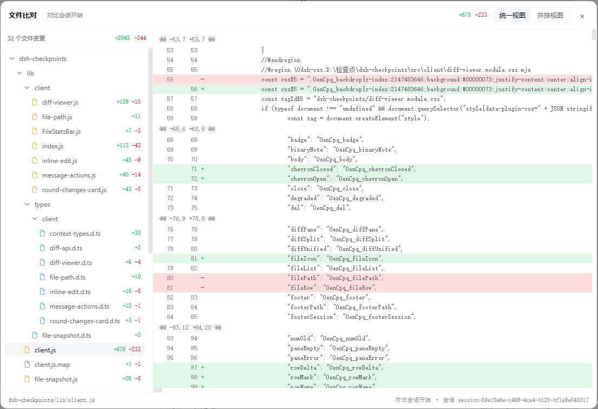

# dsh-checkpoints

DSH 对话检查点插件：把**每次你发送的用户指令**当作一个检查点列出来，支持：

- **定位**：点击检查点，平滑滚动到聊天记录里对应的那条指令，不用自己滚轮。
- **编辑/撤回**：把某条已发送的指令连同它之后的内容撤回，并在原位打开编辑框——可以切换模型和思考强度；发送前会询问是否同时把代码改动回退到该消息之前；改完按发送，AI 就会基于修改后的指令重新回答。带图片的消息会保留缩略图（可删可加），发送时图片随消息一起恢复。
- **回退（HTTP API）**：后端提供 `/rewind` 路由，把当前会话的可见对话回退到某个检查点——该检查点之后的 AI 回复/工具结果都会从可见历史中折叠掉，你可以在原会话继续；可同时恢复该检查点时的文件状态。
- **本轮改动（输入区上方）**：在任务栏与对话输入框之间的固定区域内嵌「本轮改动」卡片，实时列出本轮对话（最近检查点以来）改动的文件与 `+a -d` 行数，可单文件撤销、点击查看差异；默认收起，收起/展开状态跨会话、跨刷新记忆。
- **文件 diff 比对**：点击任意改动文件（输入区上方的「本轮改动」卡片或侧栏）打开 VS Code 式比对弹窗——左侧是**可折叠目录树**（目录/子目录逐级折叠、行内只显示名称、超长才省略，带 A/M/D 与 `+/-` 徽标）+ 汇总条，右侧带行号的彩色差异，支持**统一视图 / 并排视图**切换。
- **文件改动统计**：侧栏下半显示本次会话累计的文件改动，每行大字文件名 + 小字灰色路径，类似 VS Code 的 `+a -d` 列表，每个文件可单独撤销、查看差异。

## 界面预览

**右缘「检查点」抽屉与输入区上方的「本轮改动」栏——默认收起：**


**展开后：上半为检查点列表，下半为本次会话累计的文件改动：**


**VS Code 式文件比对弹窗：左侧可折叠目录树 + 「N 个文件变更」汇总条，右侧统一/并排差异：**



**已发送对话下方的「编辑」按钮（与复制按钮并排，带图片的消息同样定位正确）：**


**原位编辑：重选模型与思考强度、修改内容，带图片的消息保留缩略图（可删可加）：**


## 原理

DSH 的会话日志是 **append-only** 的，不能真的删除/改写旧事件。本插件用 DSH 官方支持的 surface `replace` 机制追加一条“替换节点”，让**模型可见的历史**和**网页对话流**折叠到目标位置；原始日志仍然完整保留。

文件侧：

- 每次你发送一条真实用户指令时，插件会为该会话的工作目录拍一个**文件快照**。当前采用 **VS Code 式混合策略**：
  - Git 仓库：已跟踪文件用轻量 Git 快照，未跟踪/新建文件用复制快照；
  - 非 Git 仓库：直接用完整复制快照。
- “最近检查点”统计 = 当前工作区 vs 最近一条用户指令时的快照（显示在输入区上方的「本轮改动」卡片）。
- “本次会话”统计 = 当前工作区 vs 会话开始时的快照（显示在侧栏）。
- **文件比对** = 从基准快照读出该文件的旧内容（混合快照优先未跟踪副本、再回退 Git blob），与工作区当前内容做 Myers 行级 diff，输出带行号的统一 diff hunk。
- 回退文件 = 用对应检查点的快照覆盖当前工作区（只覆盖快照里存在的文件，检查点之后新建的文件默认保留）。
- 单文件撤销 = 从当前选中的基准快照恢复该文件（如果该文件在快照里不存在，会移入回收区而不是永久删除）。

## 安装

在 DSH checkout 之外开发/安装：

```sh
cd dsh-checkpoints
npm install
npm run build

dsh plugin --profile web add /absolute/path/to/dsh-checkpoints
# 然后重启 web profile
```

如果使用本地 DSH checkout 做类型链接，参考 DSH 插件文档把 `@deepseek-ai/*` peer 依赖链接到 checkout 的构建产物。

## 使用

1. 安装并重启后，网页右缘会出现一个 **检查点** 侧边标签。
2. 点击标签打开右侧边栏：上半是**检查点**列表，下半是**文件改动**统计，两栏各占一半、各自独立滚动。
3. 检查点列表按顺序列出你发过的每条用户指令：
   - 点击任意一条即可**定位**：平滑滚动到聊天记录里那条指令（必要时自动加载更早的历史）。
   - 带 **⭯** 徽标表示该检查点有文件快照，编辑时可同时恢复文件。
4. 聊天里你发过的消息下方有**编辑**按钮：
   - 原消息被撤回并在原位打开编辑框，可切换模型与思考强度；
   - 发送前会询问是否同时回退代码改动；
   - AI 会基于修改后的指令重新回答。
5. 输入框上方、任务栏下方的**本轮改动**卡片：
   - 实时列出本轮对话（最近检查点以来）改动的文件与 `+新增 -删除` 行数，回合进行中即开始更新；
   - 宽度与任务栏同规格（dock 列统一公式），文件列表最多 180px 高、内部滚动；
   - 点击文件名打开**文件比对**弹窗；点“撤销”把单个文件恢复到最近检查点；
   - 本轮没有文件改动时卡片自动隐藏。
6. 侧栏下半的**文件改动**统计条（本次会话累计）：
   - 点“刷新”立即重算；展开后显示每个文件的 `+新增 -删除` 行数（二进制文件单独标注）；
   - 点击文件名打开**文件比对**弹窗；点“撤销”把单个文件恢复到会话开始时；
7. **文件比对**弹窗（VS Code 风格）：
   - 左侧是改动文件列表（含 `+/-` 徽标），右侧是带行号的彩色差异；
   - 顶部可切换 **统一视图 / 并排视图**，`Esc` 或点击遮罩关闭；
   - 二进制文件、超大文件（>4MB）会明确提示，不强行逐行比较。

> 编辑功能采用“撤回并原位重写”的方式实现：旧回复会被移除，编辑后的内容通过普通输入框路径发出。这是为了避免在 append-only 日志里产生重复消息。若自动发送失败，插件会把编辑文本弹窗展示出来，不会静默丢失。

## HTTP 路由

| 方法 | 路径 | 说明 |
|---|---|---|
| GET | `/plugins/dsh-checkpoints/list?sessionId=<id>` | 返回当前可见的用户指令检查点，含 `hasSnapshot`（该检查点是否有文件快照） |
| GET | `/plugins/dsh-checkpoints/surface?sessionId=<id>` | 返回被 surface replace 折叠的事件 seq（客户端刷新后据此隐藏旧消息行） |
| GET | `/plugins/dsh-checkpoints/diff?sessionId=<id>&baseline=checkpoint\|session` | 返回文件改动统计；`degraded: true` 表示所选基准没有快照，实际对比的是会话开始 |
| GET | `/plugins/dsh-checkpoints/file-diff?sessionId=<id>&path=<rel>&baseline=checkpoint\|session` | 返回单个文件的统一 diff hunk（快照 vs 工作区）；二进制返回 `binary: true`，超过 4MB 返回 `tooLarge: true` |
| POST | `/plugins/dsh-checkpoints/rewind` | body `{ sessionId, seq, rollbackFiles?, deleteNewFiles? }`，回退对话，可选回退文件，可选删除检查点后新建文件（移入回收区）；返回 `filesRestored`（文件回滚失败时为 `false`，对话回退仍生效） |
| POST | `/plugins/dsh-checkpoints/recall` | body `{ sessionId, seq, rollbackFiles?, deleteNewFiles? }`，撤回该指令及其后内容，返回 `removedText` 与 `filesRestored`（文件回滚失败时为 `false`，对话撤回仍生效） |
| POST | `/plugins/dsh-checkpoints/undo-file` | body `{ sessionId, path, baseline }`，撤销单个文件改动 |

所有 POST 路由要求 `content-type: application/json` 且请求同源（`Origin` 与 `Host` 一致），以阻断跨站伪造请求。

> 回退/撤销文件时，如果目标检查点没有自己的快照，插件会**直接报错**而不是静默回退到会话开始的状态；diff 路由则通过 `degraded` 字段如实标注实际对比的基准。

## 配置

可通过 `cordis.patch.yml` 或 profile 配置传入：

```yaml
- insert:
    - id: dsh-checkpoints
      name: dsh-checkpoints
      config:
        snapshotRoot: /absolute/path/to/snapshot-dir
```

- `routePrefix`：路由前缀，默认 `/plugins/dsh-checkpoints`。
- `snapshotRoot`：文件快照根目录，默认 `$DSH_HOME/dsh-checkpoints`。

## 构建

```sh
npm run build      # 产物输出到 lib/
npm run typecheck  # 双目标类型检查
```

## 最近更新

- **本轮改动卡片移入输入区**：卡片改挂 `conversation.input.dock` slot（order 5），固定显示在任务栏与输入框之间——宽度沿用 dock 列统一公式（与任务栏同规格）、文件列表 180px 内部滚动，不再插入聊天流；侧栏「文件改动」保持本次会话累计视图。
- **文件 diff 比对**：新增 `/file-diff` 路由与 VS Code 式比对弹窗——改动文件列表 + 带行号彩色差异 + 统一/并排视图切换；快照旧内容与工作区新内容用 Myers 算法做行级 diff（超深编辑距离自动降级为粗块，二进制/超大文件明确标注）。
- **性能**：文件改动改为事件驱动刷新（不再每 2 秒轮询全量 diff）；行差计算加“未修改短路”与低内存 LCS；`/list` 单次读取快照索引；快照复制并发执行；diff 统计跳过超过 64MB 的文件并标注二进制；整仓/未跟踪文件恢复改为并发复制；`/diff` 复用基线解析结果；diff 弹窗切换文件不再重复拉列表。
- **性能（续）**：相同 URL 的 diff 请求在飞行期去重；MutationObserver 只对对话流相关变更触发重扫；`isGitRepo` 按工作区缓存；快照捕获复用已读 index。
- **正确性（续）**：`snapshotRoot` 位于工作区内部时，未跟踪文件捕获与 diff 会跳过快照库自身，避免把它统计为新增文件。
- **快照**：Git 快照提交钉入 `refs/dsh-checkpoints/*` 命名空间，不再怕被 `git gc` 回收；跳过快照根自身与超过 64MB 的单文件。
- **正确性**：目标检查点没有快照时，回退/撤销文件直接报错（不再静默回退到会话开始）；diff 返回 `degraded` 如实标注实际基准；修复中文路径转义、二进制文件、重命名文件的统计。
- **安全**：POST 路由校验 `content-type: application/json` 与同源 Origin，阻断跨站伪造。
- **界面**：侧边栏上下两栏各占一半、独立滚动；检查点行显示 ⭯ 快照徽标；编辑框支持选择思考强度；发送失败时明确提示，不丢文本。

## 限制

- 会话正在运行时（`agent.status === 'running'`）会拒绝回退/编辑/单文件撤销，请先停止当前回合。
- 编辑第一条消息时，插件会用一条空 assistant 消息作为替换节点把可见对话清空；空 assistant 不产生模型消息，因此可以正常重发。
- 当前采用**混合快照**：Git 仓库里，已跟踪文件走 Git，未跟踪/新建文件走复制；非 Git 仓库走完整复制。快照会跳过 `node_modules`、`.git`、`dist`、`build` 等目录，也会跳过快照根目录自身和超过 64MB 的单个文件。Git 快照提交会钉在 `refs/dsh-checkpoints/<会话>/` 命名空间下，避免被 `git gc` 回收。
- 整体文件回退是“覆盖式”的：恢复 Git 已跟踪文件 + 复制回来的未跟踪快照文件；检查点之后新建的未跟踪文件默认保留，不会自动删除。
- 如果回退时选择“删除检查点之后新建的文件”，这些文件不会被永久删除，而是先移入快照根目录下的 `quarantine/<session>/<时间戳>/` 回收区，需要时还可以手动找回。
- 单文件撤销：如果该文件在快照中不存在，也会移入上述回收区，而不是永久删除。
- 插件不负责数据库、远程 API、外部进程等非文件副作用。
- 原始日志中的旧事件仍然存在；如果你需要“彻底删除”日志事件，当前 DSH 设计不支持，请使用 fork 分支或等待官方 recall/rewind 能力。
